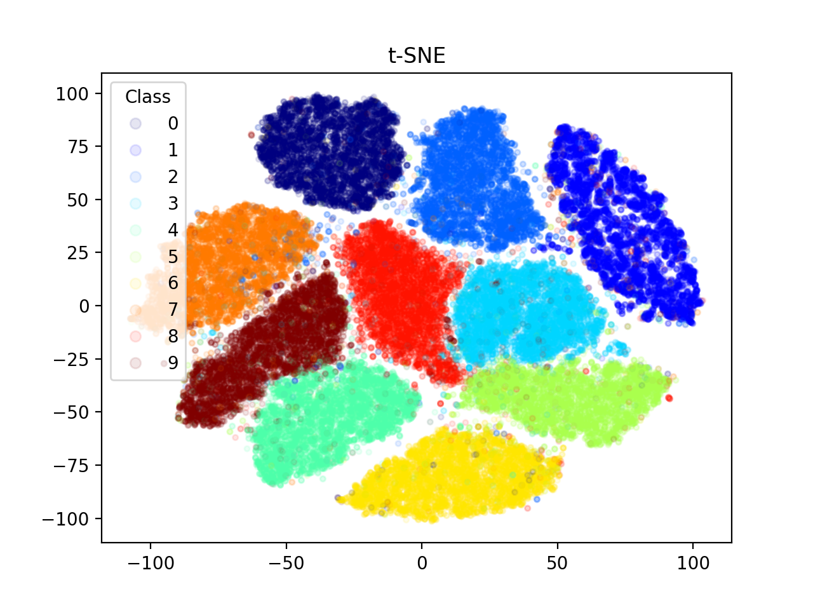
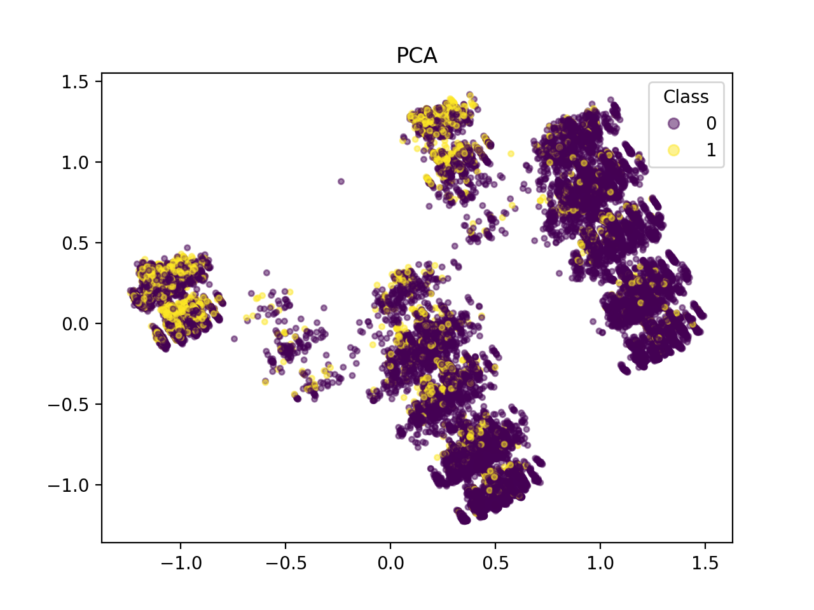
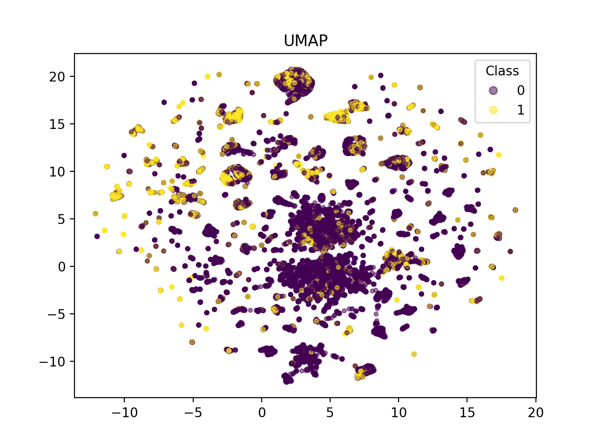

# PCA, t-SNE, UMAP Dimensionality Reduction

- PCA（Principal Component Analysis）是一种线性降维技术，通过找到数据中的主成分（主要特征方向），将高维数据映射到低维空间，保留数据的主要信息。
- t-SNE（t-distributed Stochastic Neighbor Embedding）是一种非线性降维算法，它通过优化高维数据与低维嵌入之间的分布相似度，实现将高维数据映射到低维空间，并保留数据点之间的局部相似关系。
- UMAP（Uniform Manifold Approximation and Projection）是一种非线性降维算法，它基于局部拓扑结构保持，将高维数据映射到低维空间，同时保持数据点之间的相对距离关系。

三种方法对比：（在较大数据集上，不考虑加载时间）

- 效果 UMAP, t-SNE > PCA
- 运算时间：PCA < UMAP < t-SNE（t-SNE时间复杂度太大，大数据会非常久）

## MNIST 2D

## MNIST 3D

## float 2D

