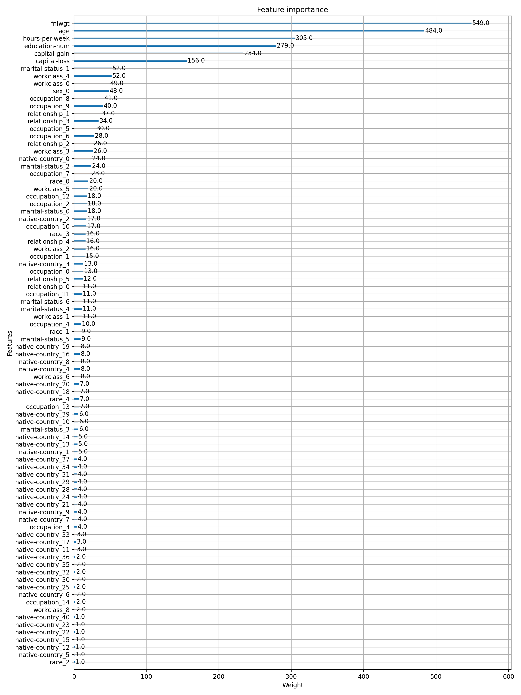

# 提取特征权重

| index | feature |	importance |
|  ----  | ----  | ----  |
| 16	| marital-status_1 |	0.43330792 |
| 3	| capital-gain	| 0.05495588 |
| 2	| education-num	| 0.036196277 |
| 24	| occupation_2	| 0.030374518 |
| 4	| capital-loss	| 0.021946002 |
| 34	| occupation_12	| 0.020106567 |
| 37	| relationship_0	| 0.020088488 |
| 30	| occupation_8	| 0.019657772 |
| 0	| age |	0.012189315 |
| 25	| occupation_3	| 0.011672632 |
